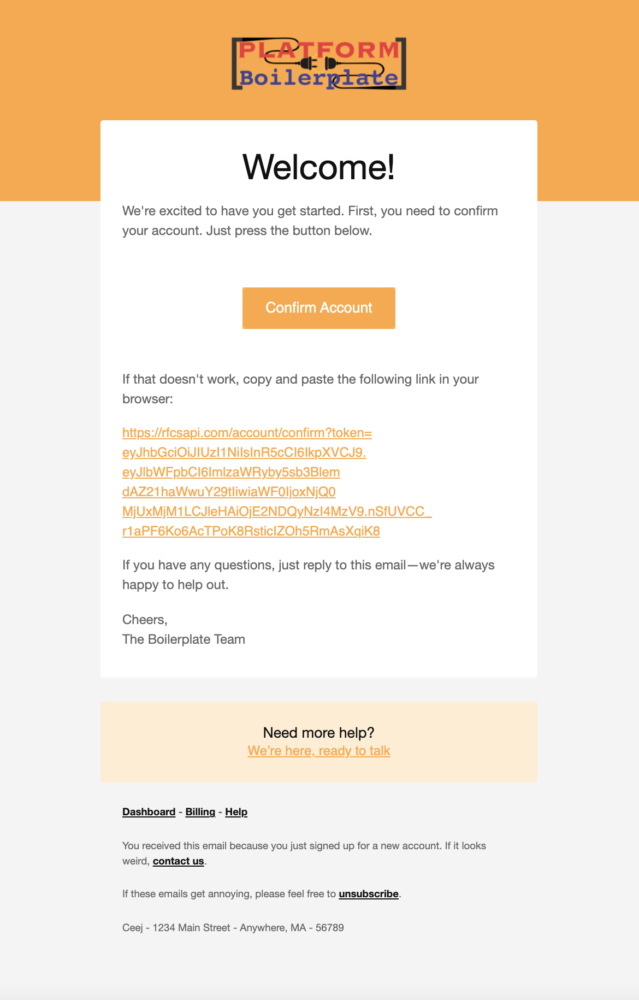

# Mailer Microservice

## Description

A microservice that handles the queue of sending emails to confirm create of account.

## Installation

```bash
$ npm install
```

## Running the app

```bash
# development
$ npm run start

# watch mode
$ npm run start:dev

# production mode
$ npm run start:prod
```

## Test

```bash
# unit tests
$ npm run test

# e2e tests
$ npm run test:e2e

# test coverage
$ npm run test:cov
```

## Screenshots



## Support

Mailer is an MIT-licensed open source project. It can grow thanks to the sponsors and support by the amazing backers. If you'd like to join them, please [read more here](https://docs.nestjs.com/support).

## Stay in touch

- Author - [Isidro A. López G.](https://github.com/ialopezg)
- Website - [https://ialopezg.com](https://ialopezg.com/)
- Twitter - [@isidrolopezg](https://twitter.com/isidrolopezg)

## License

Mailer is [MIT licensed](LICENSE).
